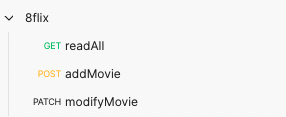
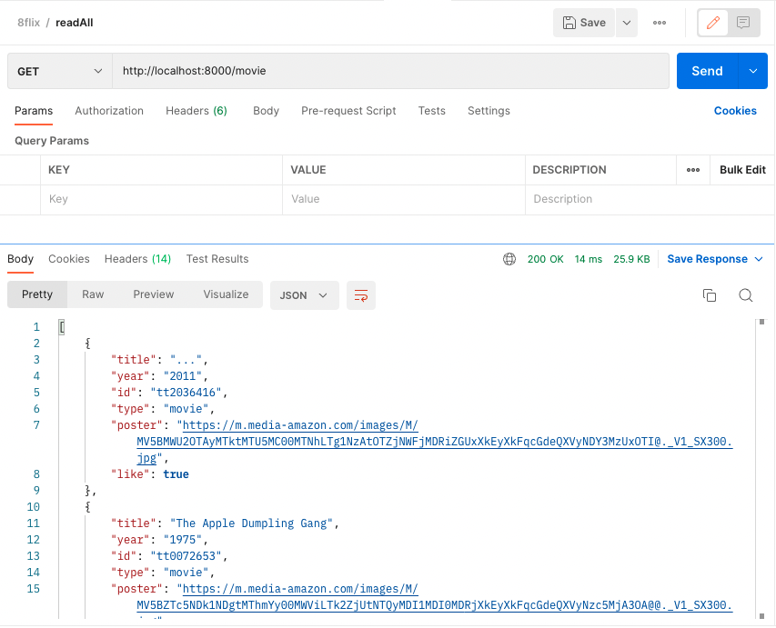
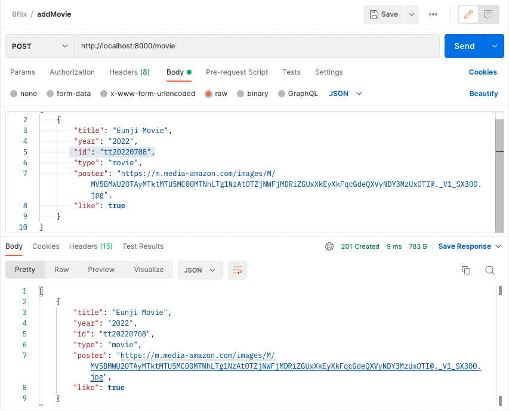
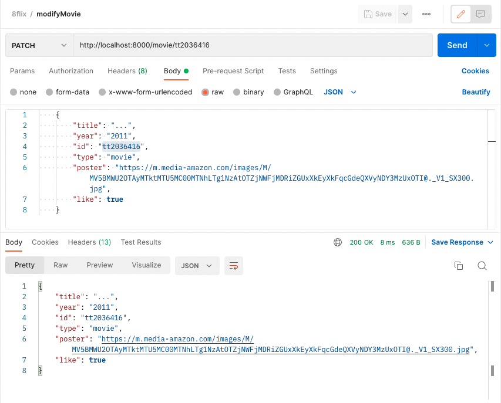

# Json-Server

## Json Server

- 서버를 직접 구현하지 않고 간단한 CRUD를 할수 있는 npm package이다.
- 아주 짧은 시간에 REST API를 구축해주는 라이브러리이다. REST API 서버의 기본적인 기능을 대부분 갖추고 있다.
  <br/>
  <br/>

### 1. install

```
npm install -g json-server
```

### 2. server 실행

```
npm run start
```

<br/>

## PostMan을 이용한 실습

request list  

<br/>

GET : 전체 목록 조회  
  
<br/>

POST : movie 등록

<br/>

PATCH : movie 내용 일부 수정

<br/>

## HTTP methods

- http는 request method를 정의하며, 주어진 리소스에 수행하길 원하는 행동을 나타낸다.
- methods
  - GET : 리소스 조회, query를 사용하여 전달한다.
  - POST : 요청 데이터처리, 주로 등록에 사용. Body를 통새 서버로 데이터를 전달한다.
  - PUT : 리소스를 대체, 해당 리소스가 없으면 생성
  - PATCH : 리소스를 일부만 변경
  - DELETE : 리소스 삭제

## Status code

- 1xx : 요청이 수신되어 처리중
- 2xx : 요청 정상 처리
- 3xx : 요청을 완료하려면 추가 행동이 필요
- 4xx : 클라이언트 오류, 잘못된 문법등으로 서버가 요청을 수행할 수 없음
- 5xx : 서버오류, 서버가 정상 요청을 처리하지 못함

## 참고 문서

- [Json-parser 이해하기](https://redux-advanced.vlpt.us/3/01.html)
- [HTTP 상태코드](https://developer.mozilla.org/ko/docs/Web/HTTP/Status)
- [HTTP 메소드와 상태코드](https://kyun2da.dev/CS/http-%EB%A9%94%EC%86%8C%EB%93%9C%EC%99%80-%EC%83%81%ED%83%9C%EC%BD%94%EB%93%9C/)
